
<h1 align="center">基于Java的茶产品销售平台设计与实现</h1>

## 简介
茶产品销售平台：角色分为管理员、用户；功能包括茶叶信息管理、购物车、订单管理、公告管理、充值支付、客户服务、用户注册登录及个人信息管理。    --计算机毕业设计源码；毕设源码；java毕业设计源码

## 联系方式

<h3 align="center">获取完整代码与数据库文件 + 微信：deepguan QQ: 86050149 QQ群: 783742310</h3>

<h3 align="center">可帮忙远程部署 包运行成功！提供远程部署、修改代码、设计文档指导、代码讲解等服务！</h3>

## 功能介绍（完整见运行截图）
管理员： 管理员可以通过系统管理和订单管理模块有效管理订单信息，包括查看订单详情、发货和物流操作。用户管理功能允许管理员添加、修改和删除用户信息，并查看用户订单历史。可管理茶叶信息和公告，通过添加、修改、删除等操作管理茶叶种类和公告信息。客服聊天模块支持管理员高效处理客户咨询，提升用户体验。

用户： 用户可以注册和登录账户，以访问个人中心查看和修改个人信息、管理地址和查看订单历史。商品模块允许用户浏览茶叶产品，查看详细信息，添加商品到购物车，并进行购买操作。订单确认界面支持用户选择收货地址、备注订单信息，并完成在线支付。导航栏便捷访问首页、茶叶信息和购物车，提升整体购买体验。

## 运行截图
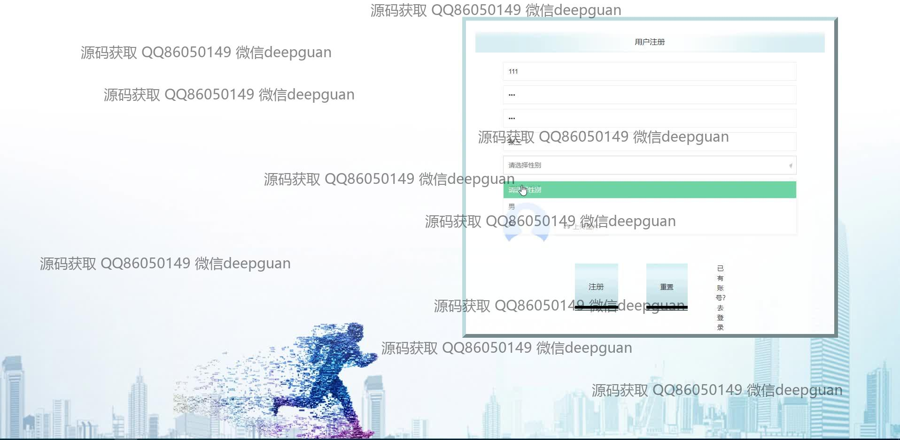
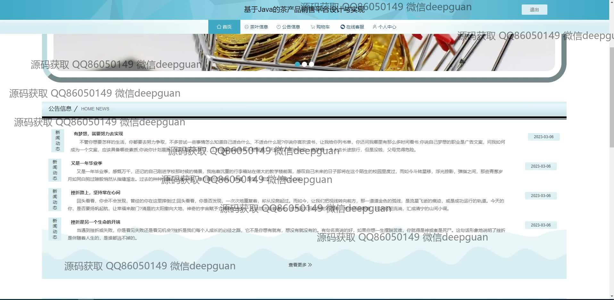
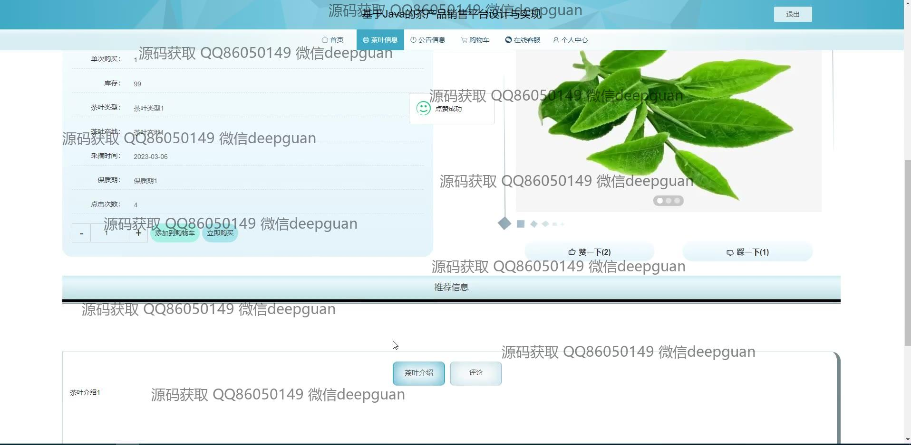
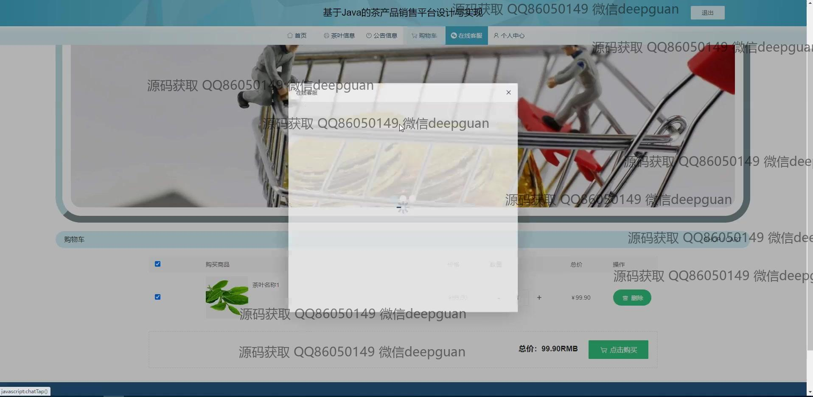
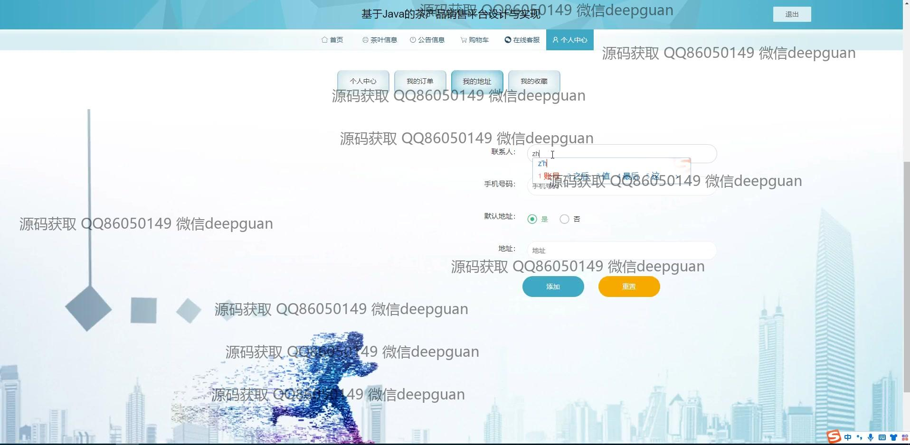
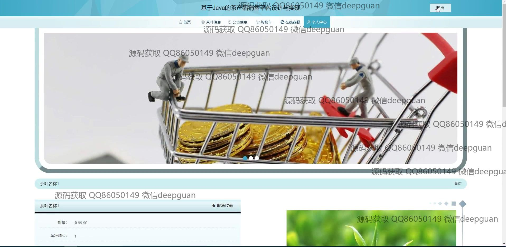
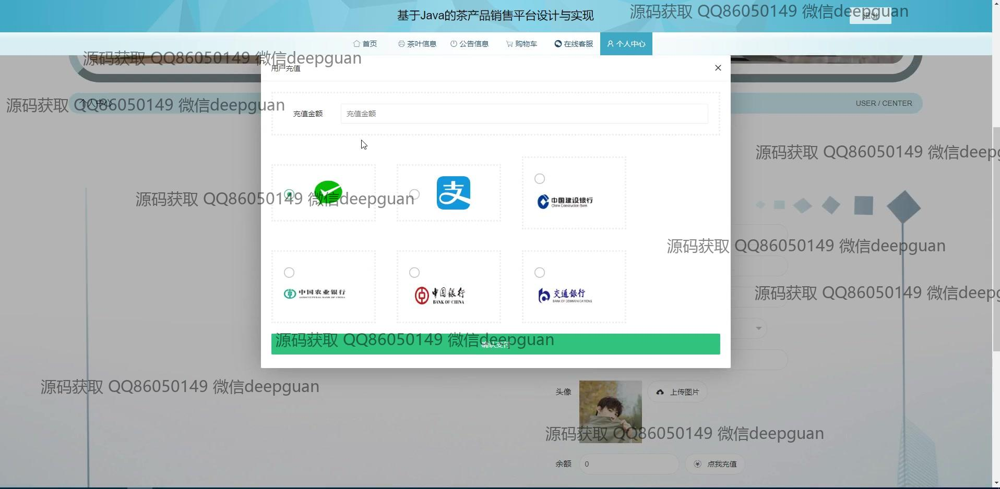
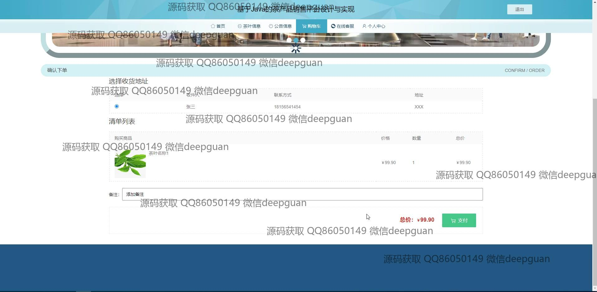
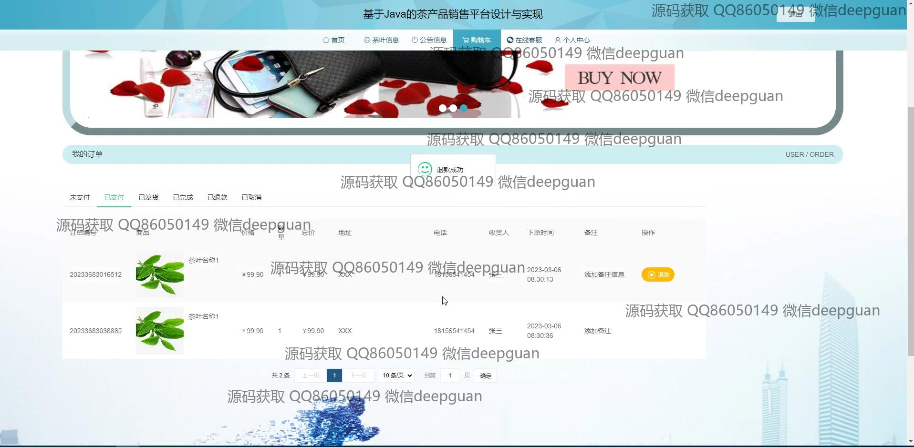
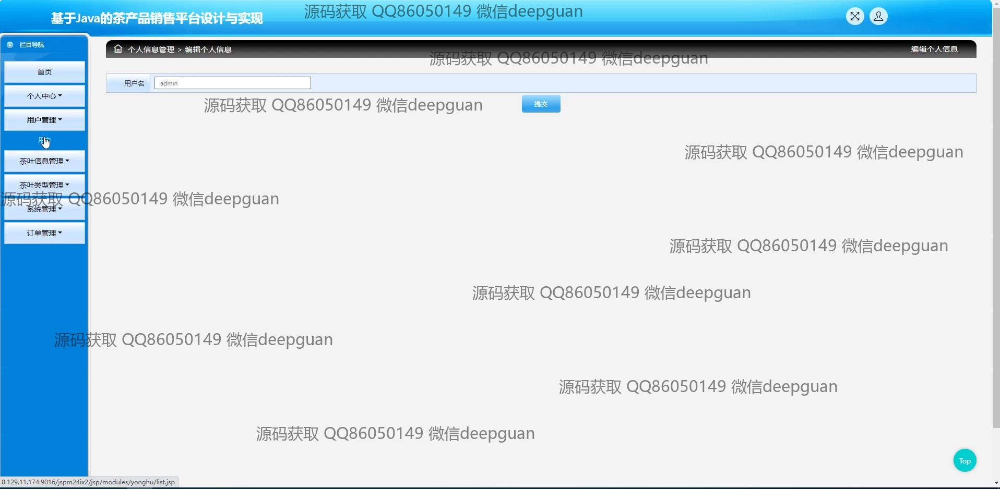
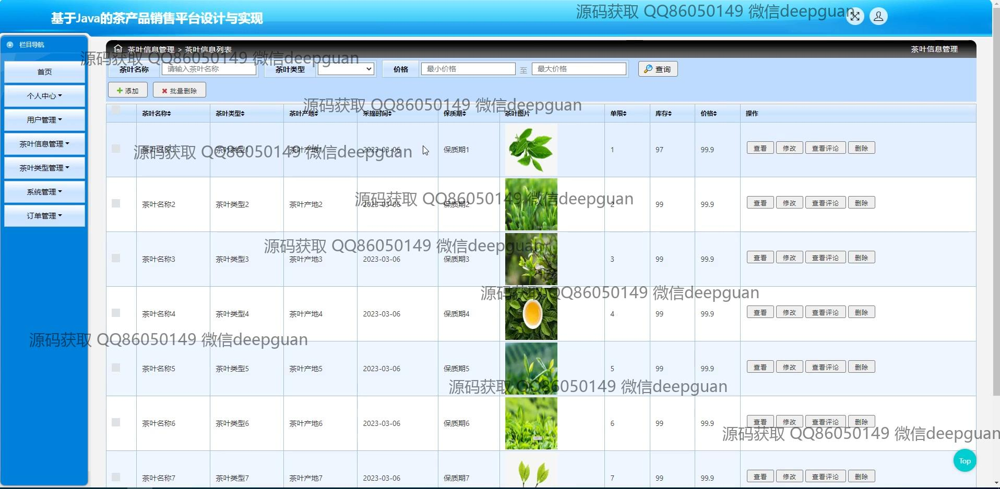
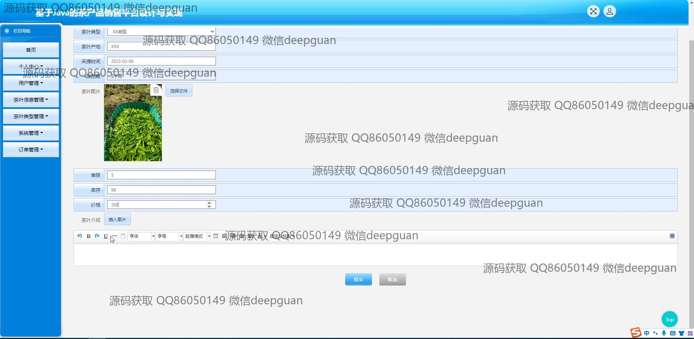
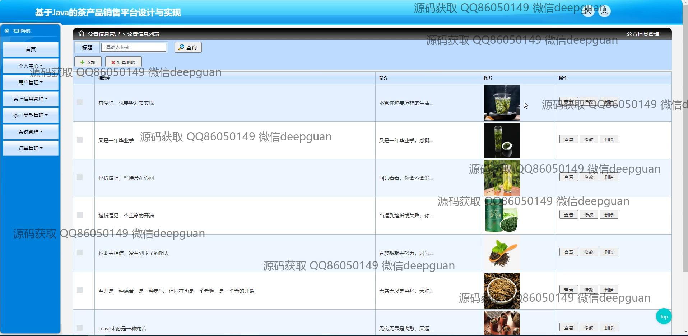
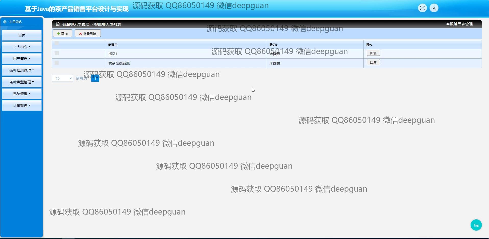
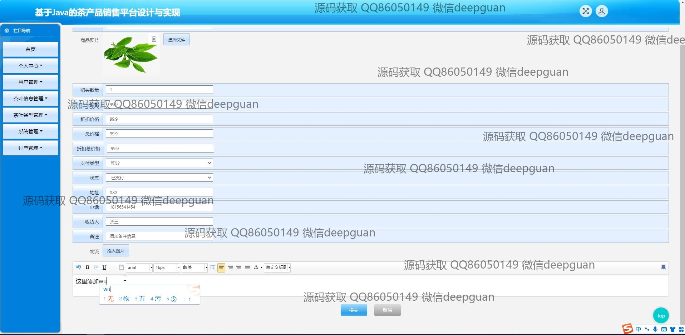
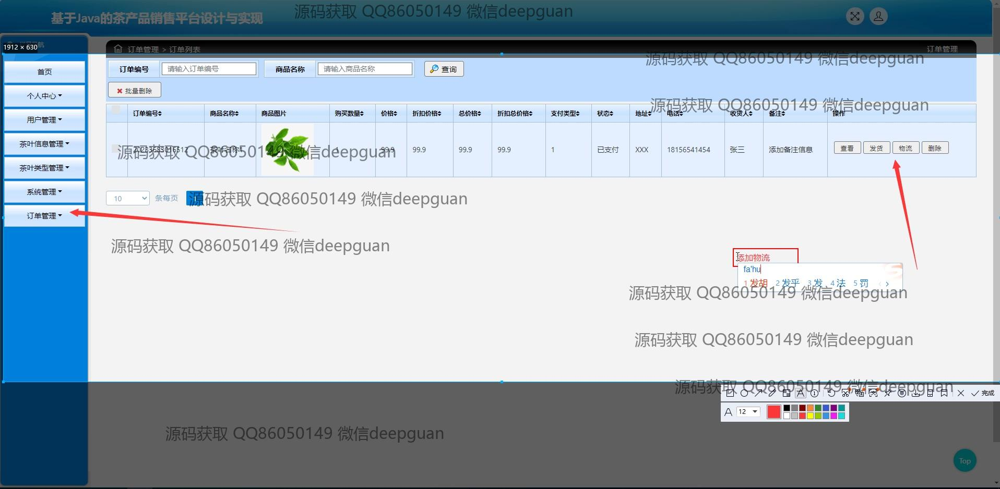
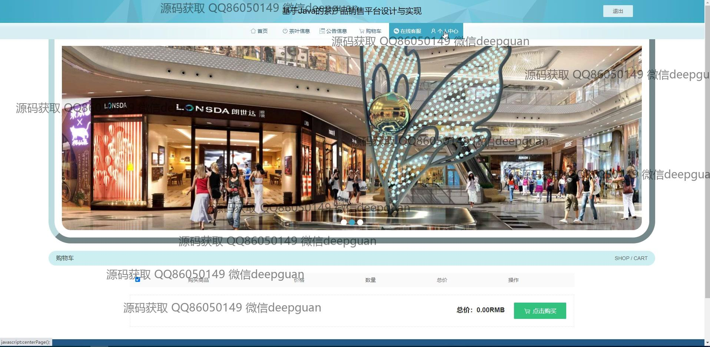
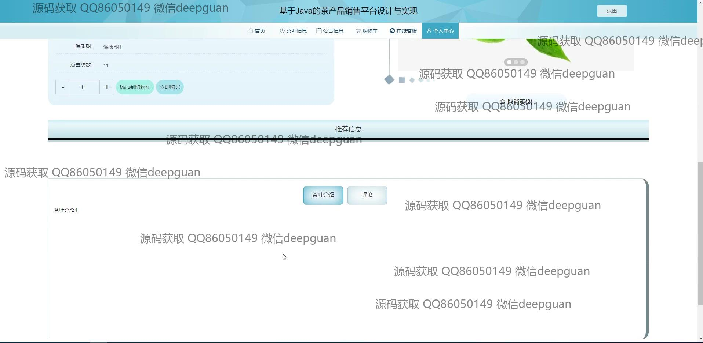
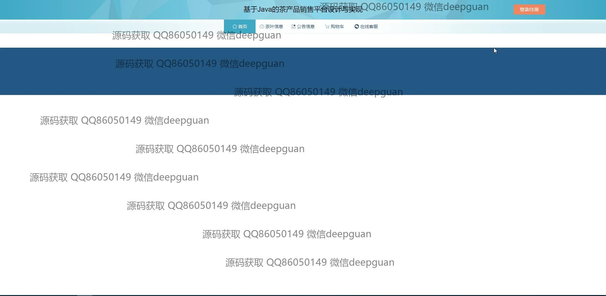

本代码来源于网络,仅供学习参考使用!

